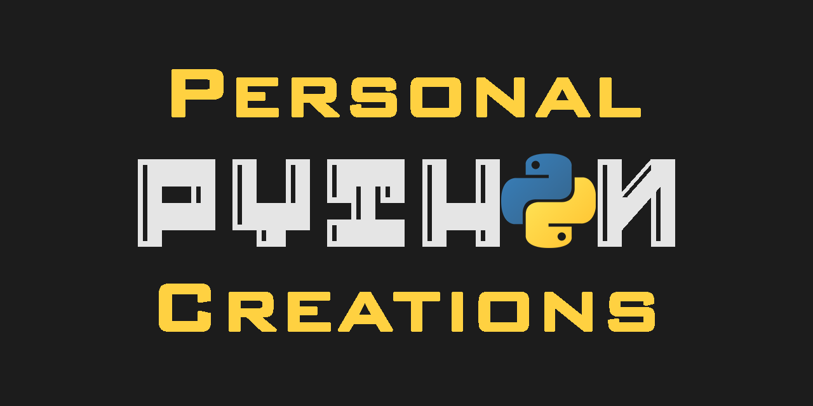

  

[Digital CLock w/GUI](https://github.com/a-burlacu/Personal-Python-Creations/blob/main/Digital-Clock-GUI/main.py)

*Digital clock displays current time in a pop up window, includes Exit button to close application. Created using Tkinter toolkit*

[Automatic Program Terminator](https://github.com/alina-burlacu/Personal-Python-Creations/blob/main/auto_exit_program.py)

*Short program that exits out of any external open program on Windows at a specific time/date.*

[Caesar Cipher Program](https://github.com/alina-burlacu/Personal-Python-Creations/blob/main/caesar_cipher.py)

*School project that uses a shift cipher to encrypt/decrypt plain text messages.*

[Luhn Algorithm-Credit Card Number Checker](https://github.com/alina-burlacu/Personal-Python-Creations/blob/main/luhn_algorithm.py)

*School project that reads CC numbers from file and checks if valid then reports status in separate output file.*

[Vigenere Cipher Program](https://github.com/alina-burlacu/Personal-Python-Creations/blob/main/vigenere_cipher.py)

*School project that uses a series of shift ciphers to encrypt/decrypt plain text messages based on the letters of a keyword*

